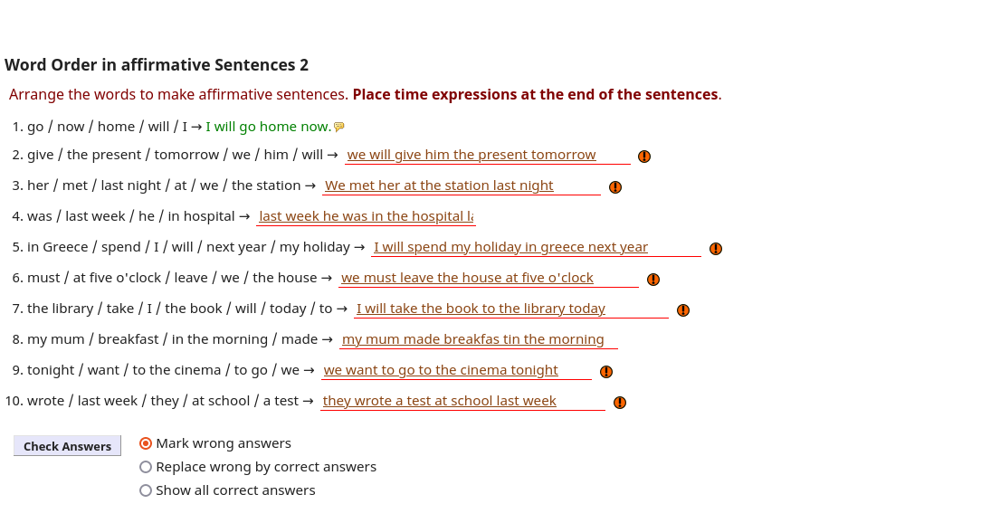
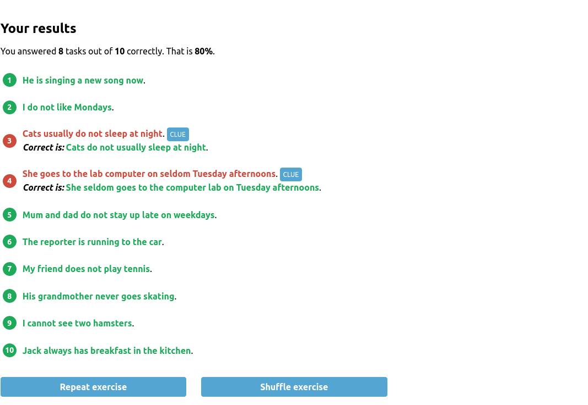

# les5
word order, adverb/adjactives and passive

## excersises
### word order
[excersise](https://www.englisch-hilfen.de/en/exercises/word_order/sentences10.htm)

[excersise2](https://www.ego4u.com/en/cram-up/grammar/word-order/exercises?02)

### adjactives and adverb
see docs in folder

